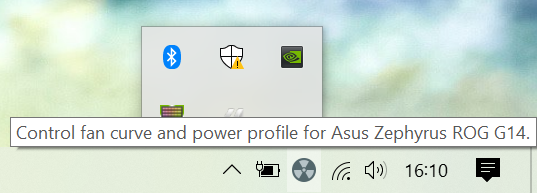
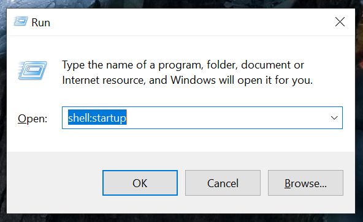
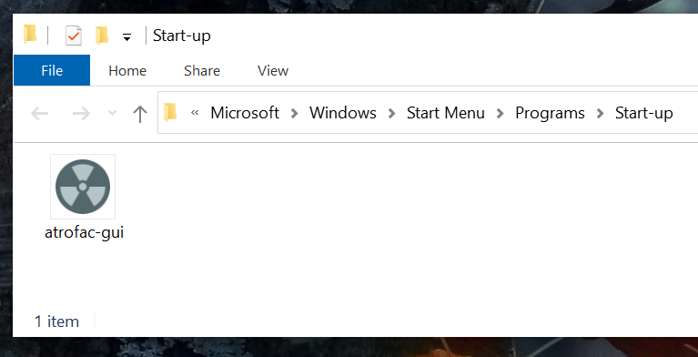
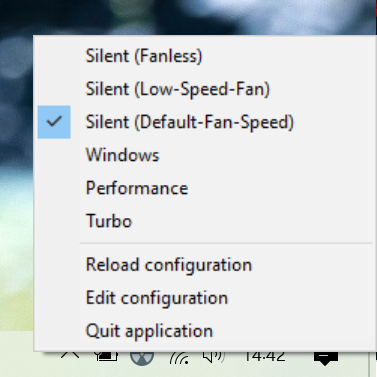
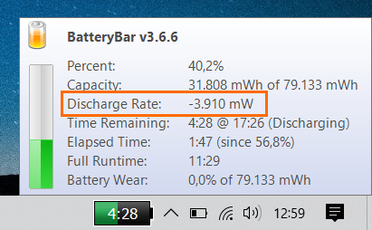
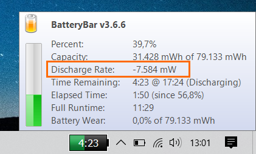

# atrofac

A GUI, a library and a command line application to control the power plan, and the fan curve (CPU & GPU) of Asus Zephyrus G14 devices (might also work with other devices that use the Armoury Crate Service). Fanless mode is possible as long as the GPU & CPU temperatures are not too hot (even on battery). 

## WARING / DISCLAIMER

**USE THIS AT YOUR OWN RISK. MANUALLY ADJUSTING FAN CURVES CAN BE DANGEROUS (MIGHT BREAK YOUR DEVICE). FRANKLY I HAVE NO IDEA WHAT I'M DOING SINCE THERE'S NO DOCUMENTATION FROM ASUS ON HOW TO MANUALLY ADJUST THE FAN CURVES. ATROFAC TRIES TO PREVENT YOU FROM SETTING A DANGEROUS FAN CURVE (THE SAME WAY ARMOURY CRATE DOES).**

## State / Changes

Has been in use for more than a month (end of may 2020 - early july 2020) and works with some minor flaws (see reddit for details and read this documentation). This is my G14 model: firmware `GA401IU.212`, Ryzen 7 4800HS, GeForce GTX 1660 Ti.  According to reddit it seems to work for other users too (and even other notebook models): [https://www.reddit.com/r/ZephyrusG14/comments/go16hp/fanless_completely_silent_on_battery_manual_fan/](https://www.reddit.com/r/ZephyrusG14/comments/go16hp/fanless_completely_silent_on_battery_manual_fan/).

Changes : [CHANGES.md](CHANGES.md)

## Getting started (end user documentation)

You most likely want to use the atrofac GUI (if not, see here for the command line version: [ADVANCED.md](ADVANCED.md)). It's a simple system tray application that runs in the background.



### Step 1: Download

Download the binary: [atrofac-gui.exe](bin/atrofac-gui.exe).

### Step 2: Autostart

You usually want atrofac to be started when your computer starts. You can also skip this step and start the application manually.

Press Windows-Key + R. This opens "Run":



Enter `shell:startup`. Now move the "autrofac-gui" to the Start-up folder. Done.



### Step 3: Start the app

Start the app and you should see a new icon in the system tray; the app is running.



### Step 4 (optional): Reduce power drain

To make sure the G14 stays fanless, you have to make sure the device does not get too hot / drains too much power. There's a good article, read it and apply the suggestions: [https://blog.remjx.com/how-to-fix-thermal-battery-life-issues-asus-zephyrus-g14-g15-2020/](https://blog.remjx.com/how-to-fix-thermal-battery-life-issues-asus-zephyrus-g14-g15-2020/). Things I did:

 * Updated the Bios and all drivers.
 * "Disable CPU Boost on default power profile": I set "Processor performance boost mode" to "Disabled" on battery and to "Efficient Enabled" when plugged in.
 * Removed "GameFirst".
 * Set "Switchable Dynamic Graphics" to "Force power-saving graphics" on battery. (in Windows "Edit power plan").
 * Disabled all windows background apps (it should be enough if you just disable those that utilize the NVidia-GPU). (see "Windows Settings > Background Apps").
 
This is the result:

About 4 watts idling with minimum brightness:
 


About 7.6 watts idling with maximum brightness:



Note: This are the values when idling... As soon as you do something (even just opening a web browser), values will increase. If your values are within +/- 20% everything is ok.

### Step 5 (optional): Remove Armoury Crate & Service

This step might be a bit controversial. I removed those two apps:

 * Armoury Crate
 * Armoury Crate Service
 
Why? Armoury Crate overwrites the settings made by atrofac on certain occasions (when waking up, after a restart, when plugging in, on unplug). To make sure this does not happen, I just uninstalled Armoury Crate & Armoury Crate Service. I suggest doing that too - you can re-install those apps later if this does not work for you.

#### Alternative 1

Keep Armoury Crate and manually re-apply the desired plan in atrofac every time Armoury Crate overwrites the settings made by atrofac.

#### Alternative 2  

Set `refresh_interval_sec` to a value (about 30-120 seconds). See below for more details. **I wouldn't advise it**: Why? Every time atrofac (and also Armoury Crate) applies a power plan, there's a short peak in power consumption (up to 25 watts). I can't really tell the impact on battery life - the 25 watts drain could just be for a millisecond - but it's long enough to be visible in [BatteryBar](http://batterybarpro.com/). (technical detail: unfortunately I have not yet figured out how to read out the current power plan - if this was possible I could apply the power plan only when something has changed).

### Optional: Change settings

atrofac comes preconfigured with 6 different profiles ("Silent (fanless)", "Silent (low-speed fan)", ...). If you want to see what those profiles do - or change them, click on "Edit configuration"; the configuration is just a yaml file. After saving the file you have to click "Reload configuration" to apply the changes. If you break the configuration file, the app won't start up anymore. Don't worry: Just delete the broken configuration file and atrofac will create a new one. The file can be found here (note: the folder `AppData` is hidden by default):

``
C:\Users\<YOUR_USER_NAME>\AppData\Roaming\atrofac_gui_config.yaml
``  

An entry for a plan looks like this:

```yaml
  - name: Silent (Fanless)
    plan: silent
    cpu_curve: "30c:0%,49c:0%,59c:0%,69c:0%,79c:31%,89c:49%,99c:56%,109c:56%"
    gpu_curve: "30c:0%,49c:0%,59c:0%,69c:0%,79c:34%,89c:51%,99c:61%,109c:61%"
```

 * `name`: The name, obviously.
 * `plan`: One of `silent`, `windows`, `performance`, `turbo`. 
 * `cpu_curve`: CPU fan curve, see [ADVANCED.md](ADVANCED.md).
 * `gpu_curve`: GPU fan curve, see [ADVANCED.md](ADVANCED.md).
 * `refresh_interval_sec` (optional): Armoury crate will overwrite the changes made by atrofac eventually (usually when waking up from sleep; when going from AC to DC or vice versa). So atrofac will periodically apply the settings every n seconds. It has been renamed from `update_interval_sec` to make sure it's gone when somebody updates the app and keeps the old configuration. Why: see "end user documentation".
 * `refresh_on_apm_resume_automatic` (optional; default value is `true`): If this is true, atrofac will re-apply the plan after resuming from sleep or hibernation. You usually want this to be `true`. (technical detail: see Win32 API `PBT_APMRESUMEAUTOMATIC`).  
 
You can also omit `cpu_curve` and `gpu_curve` in that case the default fan curves (as defined by Asus) are used. 

## Binaries

There's no CI yet, but there are prebuilt binaries:

 * GUI: [atrofac-gui.exe](bin/atrofac-gui.exe)
 * CLI-tool: [atrofac-cli.exe](bin/atrofac-cli.exe)

## Advanced

See [ADVANCED.md](ADVANCED.md) if you need more information such as:

 * The command line version of this tool.
 * Building.
 * Technical information.
 * Fan-curve details.
 
### Logs
 
Log files are written to `C:\Users\<USERNAME>\AppData\Local\atrofac_logs`. These files are deleted automatically after a few days. There are two options in the config file (top level section) related to logging:
 
 * `disable_logging`: Set this to `true` to disable logging (it's `false` by default).
 * `log_spec`: A string; log specification. By default it's `info`; See [https://docs.rs/flexi_logger/0.15.7/flexi_logger/struct.LogSpecification.html](https://docs.rs/flexi_logger/0.15.7/flexi_logger/struct.LogSpecification.html) for details. 

