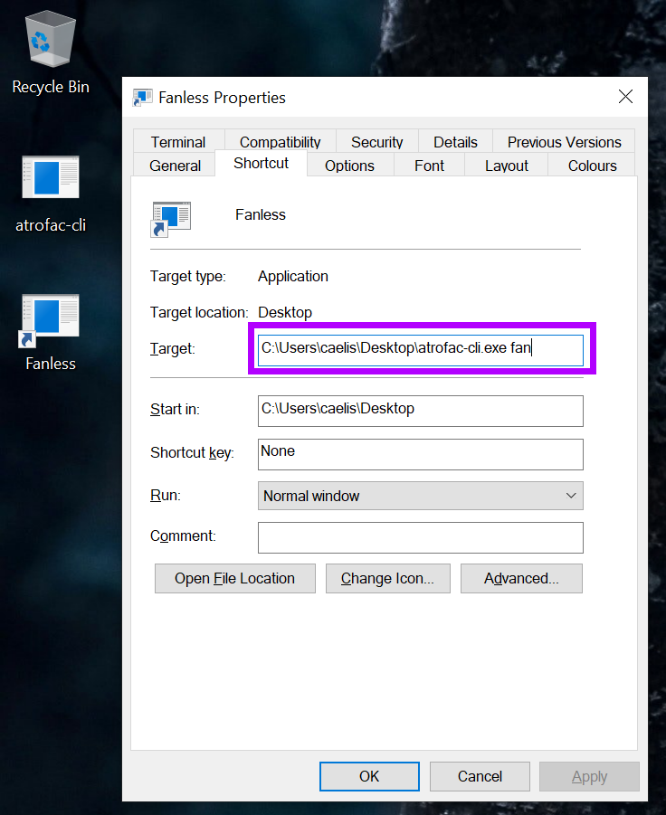

# atrofac

A library and a command line application to control the power plan, and the fan curve (CPU & GPU) of Asus Zephyrus G14 Devices (might also work with other devices that use the Armoury Crate Service). Fanless mode is possible as long as the GPU & CPU temperatures are not too hot (even on battery). 

## WARING / DISCLAIMER

**USE THIS AT YOUR OWN RISK. MANUALLY ADJUSTING FAN CURVES CAN BE DANGEROUS (MIGHT BREAK YOUR DEVICE). FRANKLY I HAVE NO IDEA WHAT I'M DOING SINCE THERE'S NO DOCUMENTATION FROM ASUS ON HOW TO MANUALLY ADJUST THE FAN CURVES. ATROFAC TRIES TO PREVENT YOU FROM SETTING A DANGEROUS FAN CURVE (THE SAME WAY ARMOURY CRATE DOES).**

## State

This is a very early proof of concept:

 * Needs to be tested on other devices than just mine (firmware `GA401IU.212`, Ryzen 7 4800HS, GeForce GTX 1660 Ti).
 * A graphical user interface would be nice.
 * Documentation from Asus would be nice.

## Building

Checkout and use a current rust version. Should build out of the box. Windows only.

There's no CI yet, but there's a prebuilt binary of the CLI-tool: [atrofac-cli.exe](bin/atrofac-cli.exe)

## Usage: `atrofac-cli`

### Change power plan

Note: This DOES NOT adjust the fan curve. It uses the default fan curve defined by Asus. 

```shell 
atrofac-cli plan <PLAN>
```

Examples:

```shell 
atrofac-cli plan silent
atrofac-cli plan performance
atrofac-cli plan turbo
atrofac-cli plan windows
```

### Change fan curve

This adjusts the fan curve and sets a power plan.

```shell 
atrofac-cli fan --plan <PLAN> --cpu <FAN_CURVE> --gpu <FAN_CURVE>
```

The `FAN_CURVE` is basically the same you can do graphically in the Armoury Crate GUI. It's a list (8 entries) of temperature and fan percentage. Assume you want to set a fan curve that looks like this:

| Entry | Temperature | Fan Percentage  |
| --- |:---:| ---:|
| 0 | 30 | 0% |
| 1 | 40 | 5% |
| 2 | 50 | 10% |
| 3 | 60 | 20% |
| 4 | 70 | 35% |
| 5 | 80 | 55% |
| 6 | 90 | 65% |
| 6 | 100 | 65% |

... in this case the `FAN_CURVE` string would look like this: `30c:0%,40c:5%,50c:10%,60c:20%,70c:35%,80c:55%,90c:65%,100c:65%`.

#### Examples

Set the silent power profile and set the fan curves (CPU & GPU) to a minimum:

```shell 
atrofac-cli fan 
```

Set the windows power plan and set the fan curves:

```shell 
atrofac-cli fan --profile windows --cpu 30c:0%,40c:5%,50c:10%,60c:20%,70c:35%,80c:55%,90c:65%,100c:65% --gpu 30c:0%,40c:5%,50c:10%,60c:20%,70c:35%,80c:55%,90c:65%,100c:65%
```

#### Limits

autrofac will automatically adjust dangerous fan curves (**NO GUARANTEE THAT THIS REALLY WORKS**). These are the limits:

| Entry | Temperature | Fan Percentage (CPU) | Fan Percentage (GPU) |
| --- |:---:| ---:| ---:|
| 0 | 30..39 | 0% or higher | 0% or higher |
| 1 | 40..49 | 0% or higher | 0% or higher |
| 2 | 50..59 | 0% or higher | 0% or higher |
| 3 | 60..69 | 0% or higher | 0% or higher |
| 4 | 70..79 | 31% or higher | 34% or higher |
| 5 | 80..89 | 49% or higher | 51% or higher |
| 6 | 90..99 | 56% or higher | 61% or higher |
| 6 | 100..109 | 56% or higher | 61% or higher |

So it's possible to operate the Zephyrus G14 fanless as long as the temperatures of the GPU & CPU are below 59 degrees celsius. 

## GUI

There's no GUI yet... but you can crate a shortcut, like this:



## Technical details

It uses the `DeviceIoControl` function (windows API) on the `\\.\ATKACPI`-file to change the power plan and set the fan curve (like the Armoury Crate does). 